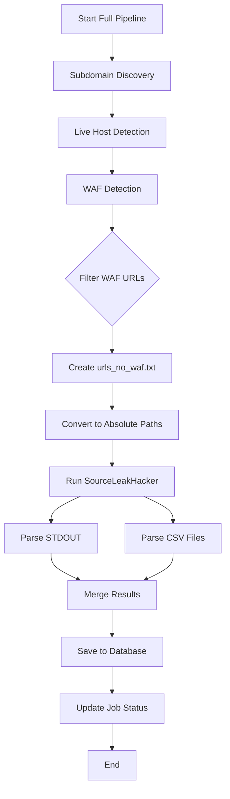

# 📖 HƯỚNG DẪN CHI TIẾT

## MỤC LỤC
1. [Cách chạy Selective Scanning API](#1-cách-chạy-selective-scanning-api)
2. [Cách Full Pipeline chạy SourceLeakHacker](#2-cách-full-pipeline-chạy-sourceleakhacker)

---

# 1. CÁCH CHẠY SELECTIVE SCANNING API

## 🎯 Mục đích
Scan **một vài URLs cụ thể** để tìm source code leaks, thay vì scan toàn bộ domain.

## 📋 Yêu cầu
- Đã có một scan job **hoàn thành** (status = "completed")
- Biết Job ID của scan đó
- URLs muốn scan phải nằm trong danh sách live hosts của job

---

## 🚀 CÁCH 1: Dùng Demo Script (Dễ nhất)

### Bước 1: Chỉnh sửa file `demo_selective_scan.py`

Mở file và thay đổi 3 thông tin:

```python
# 1. Job ID (lấy từ scan đã hoàn thành)
JOB_ID = "503505fb-8b9f-4255-891d-341959d5a2dd"

# 2. Danh sách URLs muốn scan
selected_urls = [
    "https://exam.hustack.soict.ai",  # URL bạn đang xem
    "https://taskforce.soict.ai",
    "https://coopy.soict.ai"
]

# 3. Scan mode
scan_mode = "tiny"  # hoặc "full"
```

### Bước 2: Chạy script

```bash
python demo_selective_scan.py
```

### Bước 3: Xem kết quả

Script sẽ hiển thị:
- URLs được scan
- Số lượng leaks tìm thấy
- Chi tiết từng leak (nếu có)

**Ví dụ output:**
```
📊 BƯỚC 5: Kết quả
--------------------------------------------------------------------------------
   HTTP Status: 200

✅ SUCCESS!

   Job ID: 503505fb-8b9f-4255-891d-341959d5a2dd
   URLs Scanned: 3
   Leaks Found: 0
   Message: Scanned 3 URLs in 'tiny' mode, found 0 leaks

ℹ️  No leaks found (domain is secure)
```

---

## 🔧 CÁCH 2: Dùng cURL (Manual)

### Bước 1: Tạo file JSON với URLs

Tạo file `my_urls.json`:

```json
{
  "urls": [
    "https://exam.hustack.soict.ai",
    "https://taskforce.soict.ai",
    "https://coopy.soict.ai"
  ],
  "mode": "tiny"
}
```

### Bước 2: Gọi API bằng cURL

```bash
curl -X POST http://localhost:8000/api/v1/scans/503505fb-8b9f-4255-891d-341959d5a2dd/leak-scan \
  -H "Content-Type: application/json" \
  -d @my_urls.json
```

### Bước 3: Xem response

```json
{
  "job_id": "503505fb-8b9f-4255-891d-341959d5a2dd",
  "urls_scanned": 3,
  "leaks_found": 0,
  "leaks": [],
  "message": "Scanned 3 URLs in 'tiny' mode, found 0 leaks"
}
```

---

## 🌐 CÁCH 3: Dùng Swagger UI (Giao diện web)

### Bước 1: Mở Swagger UI

Truy cập: http://localhost:8000/docs

### Bước 2: Tìm endpoint

Scroll xuống tìm endpoint:
```
POST /api/v1/scans/{job_id}/leak-scan
```

### Bước 3: Click "Try it out"

### Bước 4: Điền thông tin

- **job_id:** `503505fb-8b9f-4255-891d-341959d5a2dd`
- **Request body:**
```json
{
  "urls": [
    "https://exam.hustack.soict.ai",
    "https://taskforce.soict.ai"
  ],
  "mode": "tiny"
}
```

### Bước 5: Click "Execute"

### Bước 6: Xem response ở phần "Response body"

---

## 📝 Giải thích Parameters

### `urls` (required)
- **Type:** Array of strings
- **Description:** Danh sách URLs muốn scan
- **Example:** `["https://example.com", "https://api.example.com"]`
- **Lưu ý:** URLs phải nằm trong danh sách live hosts của job

### `mode` (optional, default: "tiny")
- **Type:** String
- **Values:** `"tiny"` hoặc `"full"`
- **Description:**
  - `tiny`: Scan nhanh với ~100 paths (1-2 phút/URL)
  - `full`: Scan kỹ càng với ~1000 paths (10-15 phút/URL)

---

## 🔍 Cách lấy danh sách URLs có thể scan

### Option 1: Từ file `live.txt`

```bash
# Xem file live.txt (JSON Lines format)
type jobs\503505fb-8b9f-4255-891d-341959d5a2dd\live.txt

# Extract URLs bằng Python
python -c "import json; [print(json.loads(line)['url']) for line in open('jobs/503505fb-8b9f-4255-891d-341959d5a2dd/live.txt')]"
```

### Option 2: Từ file `urls_no_waf.txt`

```bash
# Xem URLs không có WAF (đã được filter sẵn)
type jobs\503505fb-8b9f-4255-891d-341959d5a2dd\urls_no_waf.txt
```

### Option 3: Từ API

```bash
# Get scan results
curl http://localhost:8000/api/v1/scans/503505fb-8b9f-4255-891d-341959d5a2dd

# Filter live subdomains
curl http://localhost:8000/api/v1/scans/503505fb-8b9f-4255-891d-341959d5a2dd | python -c "import sys, json; data = json.load(sys.stdin); [print(s['subdomain']) for s in data['subdomains'] if s['is_live']]"
```

---

# 2. CÁCH FULL PIPELINE CHẠY SOURCELEAKHACKER

## 🔄 Tổng quan Pipeline

Full pipeline có **5 bước chính**:

```
1. Subdomain Discovery (subfinder, amass, assetfinder)
   ↓
2. Live Host Detection (httprobe, httpx)
   ↓
3. WAF Detection (wafw00f)
   ↓
4. Screenshot Capture (gowitness)
   ↓
5. Leak Detection (SourceLeakHacker) ← BƯỚC NÀY
```

---

## 📂 Cấu trúc thư mục Job

Mỗi scan job tạo một thư mục trong `jobs/`:

```
jobs/
└── 503505fb-8b9f-4255-891d-341959d5a2dd/
    ├── subs.txt                 # Tất cả subdomains (43 domains)
    ├── httprobe.txt             # Live URLs từ httprobe
    ├── live.txt                 # Live URLs với metadata (JSON)
    ├── waf_results.json         # Kết quả WAF detection (30 URLs)
    ├── urls_no_waf.txt          # URLs không có WAF (27 URLs) ← INPUT cho SourceLeakHacker
    ├── leaks_results/           # Output của SourceLeakHacker
    │   ├── 200.csv              # Leaks với HTTP 200
    │   ├── 403.csv              # Leaks với HTTP 403
    │   └── ...
    └── shots/                   # Screenshots
```

---

## ⚙️ Cách SourceLeakHacker được gọi trong Pipeline

### Bước 1: Pipeline tạo file `urls_no_waf.txt`

**File:** `app/services/pipeline.py` (Lines 450-470)

```python
# Filter out WAF-protected URLs
waf_urls = {w['url'] for w in waf_detections if w['has_waf']}
non_waf_urls = [h['url'] for h in live_hosts if h['url'] not in waf_urls]

# Save to urls_no_waf.txt
self.urls_no_waf_file = self.job_dir / "urls_no_waf.txt"
with open(self.urls_no_waf_file, 'w') as f:
    for url in non_waf_urls:
        f.write(f"{url}\n")
```

**Kết quả:** File `urls_no_waf.txt` chứa 27 URLs không có WAF

---

### Bước 2: Pipeline gọi `_run_sourceleakhacker_cli()`

**File:** `app/services/pipeline.py` (Lines 551-650)

```python
async def _run_sourceleakhacker_cli(
    self,
    live_hosts: List[Dict[str, Any]],
    waf_detections: List[Dict[str, Any]],
    mode: Optional[str] = None,
    selected_urls: Optional[List[str]] = None
) -> List[Dict[str, Any]]:
```

**Tham số:**
- `live_hosts`: Danh sách live hosts từ httpx
- `waf_detections`: Kết quả WAF detection
- `mode`: Scan mode ("tiny" hoặc "full")
- `selected_urls`: URLs cụ thể (cho selective scanning)

---

### Bước 3: Tạo file input cho SourceLeakHacker

**Code:** (Lines 560-580)

```python
if selected_urls:
    # Selective scanning: Chỉ scan URLs được chọn
    urls_to_scan = selected_urls
else:
    # Full pipeline: Filter out WAF-protected URLs
    waf_urls = {w['url'] for w in waf_detections if w['has_waf']}
    urls_to_scan = [h['url'] for h in live_hosts if h['url'] not in waf_urls]

# Tạo file input
urls_file = self.job_dir / "urls_for_leaks.txt"
with open(urls_file, 'w') as f:
    for url in urls_to_scan:
        f.write(f"{url}\n")
```

---

### Bước 4: Convert paths thành absolute paths

**Code:** (Lines 596-611)

```python
# SourceLeakHacker chạy từ directory riêng của nó
sourceleakhacker_dir = Path(settings.sourceleakhacker_path).parent

# Convert sang absolute paths (FIX QUAN TRỌNG!)
urls_file_absolute = Path(urls_file).resolve()
output_dir_absolute = Path(self.leaks_output_dir).resolve()

cmd = [
    settings.python_executable,
    str(settings.sourceleakhacker_path),
    f"--urls={str(urls_file_absolute)}",  # Absolute path
    f"--scale={scan_mode}",
    "--output", str(output_dir_absolute),  # Absolute path
    "--threads", str(getattr(settings, 'sourceleakhacker_threads', 8)),
    "--timeout", str(getattr(settings, 'sourceleakhacker_timeout', 1800))
]
```

**Tại sao cần absolute paths?**
- SourceLeakHacker chạy từ `E:\SourceLeakHacker\SourceLeakHacker-master\`
- Nếu dùng relative path `jobs\...\urls_no_waf.txt`, nó sẽ tìm file trong `E:\SourceLeakHacker\...` → Lỗi!
- Absolute path: `C:\recon-api\jobs\...\urls_no_waf.txt` → OK!

---

### Bước 5: Chạy SourceLeakHacker

**Code:** (Lines 613-625)

```python
# Chạy subprocess
result = subprocess.run(
    cmd,
    cwd=str(sourceleakhacker_dir),  # Working directory
    capture_output=True,
    text=True,
    timeout=timeout
)

# Log output
self.logger.info(f"SourceLeakHacker STDOUT:\n{result.stdout}")
if result.stderr:
    self.logger.warning(f"SourceLeakHacker STDERR:\n{result.stderr}")
```

**Command thực tế:**
```bash
cd E:\SourceLeakHacker\SourceLeakHacker-master\
python SourceLeakHacker.py \
  --urls=C:\recon-api\jobs\503505fb...\urls_no_waf.txt \
  --scale=tiny \
  --output C:\recon-api\jobs\503505fb...\leaks_results \
  --threads 8 \
  --timeout 1800
```

---

### Bước 6: Parse kết quả

**Code:** (Lines 627-650)

SourceLeakHacker có 2 output formats:

#### Format 1: STDOUT
```
[200] 1234 0.5s text/html https://example.com/.git/config
[403] 567 0.3s text/plain https://example.com/.env
```

#### Format 2: CSV files
```
leaks_results/
├── 200.csv
├── 403.csv
└── 404.csv
```

**CSV format:**
```csv
Code,Length,Time,Type,URL
200,1234,0.5s,text/html,https://example.com/.git/config
```

**Parsing code:**
```python
# Parse STDOUT
for line in result.stdout.split('\n'):
    match = re.match(r'\[(\d+)\]\s+(\d+)\s+([\d.]+)s?\s+(\S+)\s+(.+)', line)
    if match:
        leaks.append({
            'http_status': int(match.group(1)),
            'content_length': int(match.group(2)),
            'response_time': float(match.group(3)),
            'content_type': match.group(4),
            'leaked_file_url': match.group(5),
            ...
        })

# Parse CSV files
for csv_file in output_dir.glob('*.csv'):
    with open(csv_file, 'r') as f:
        reader = csv.DictReader(f)
        for row in reader:
            leaks.append({
                'http_status': int(row['Code']),
                'content_length': int(row['Length']),
                'leaked_file_url': row['URL'],
                ...
            })
```

---

### Bước 7: Lưu vào database

**Code:** (Lines 140-160 trong `app/workers/tasks.py`)

```python
# Save leaks to database
if leaks:
    leak_repo = LeakDetectionRepository(db)
    leak_repo.bulk_create(scan_job.id, leaks)
    
    # Update scan job
    scan_repo.update_scan_status(
        job_id,
        ScanStatus.COMPLETED,
        leaks_found=len(leaks)
    )
```

---

## 🔍 Cách kiểm tra SourceLeakHacker đã chạy

### Check 1: File `urls_no_waf.txt` tồn tại

```bash
type jobs\503505fb-8b9f-4255-891d-341959d5a2dd\urls_no_waf.txt
```

**Kỳ vọng:** 27 URLs

---

### Check 2: Directory `leaks_results/` tồn tại

```bash
dir jobs\503505fb-8b9f-4255-891d-341959d5a2dd\leaks_results
```

**Kỳ vọng:** Directory tồn tại (có thể rỗng nếu không tìm thấy leaks)

---

### Check 3: Database có leak records

```bash
curl http://localhost:8000/api/v1/scans/503505fb-8b9f-4255-891d-341959d5a2dd
```

**Kỳ vọng:** `"leak_detections": [...]`

---

### Check 4: Worker logs

Xem terminal window của Celery worker, tìm dòng:

```
[INFO] [503505fb...] SourceLeakHacker command: python E:\SourceLeakHacker\...
[INFO] [503505fb...] SourceLeakHacker completed in X seconds
[INFO] [503505fb...] Found X leaks
```

---

## 📊 Flow Chart



---

## 🎯 Tóm tắt

### Full Pipeline:
1. ✅ Tự động filter WAF-protected URLs
2. ✅ Tạo file `urls_no_waf.txt`
3. ✅ Convert sang absolute paths
4. ✅ Chạy SourceLeakHacker với mode từ `.env`
5. ✅ Parse kết quả từ STDOUT và CSV
6. ✅ Lưu vào database

### Selective Scanning:
1. ✅ User chọn URLs cụ thể
2. ✅ Tạo file input tạm thời
3. ✅ Convert sang absolute paths
4. ✅ Chạy SourceLeakHacker với mode từ request
5. ✅ Parse kết quả
6. ✅ Return trực tiếp qua API (không lưu database)

---

**End of Guide**

